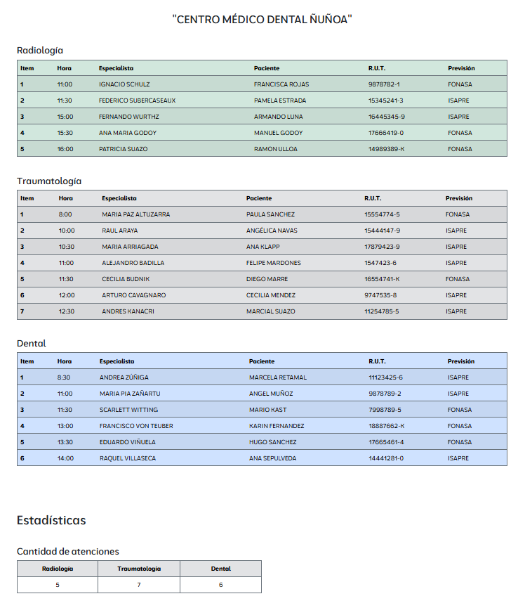
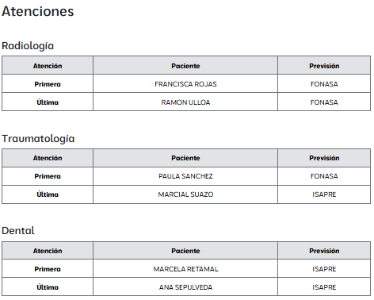

#### **Technologies Used**
- **HTML5**
- **CSS3**
- **JavaScript**

#### **Features**
- **Base de datos de atenciones médicas**:  
  Se incluyen datos estructurados en arrays de diferentes especialidades médicas (radiología, traumatología, dental).

- **Cantidad de atenciones**:  
  Funcionalidad para calcular y mostrar la cantidad de atenciones por especialidad.

- **Primera y última atención**:  
  Identificación y visualización de la primera y última atención en cada especialidad.

- **Manejo de tablas**:  
  Las atenciones se presentan en un formato tabular para una mejor visualización.

---

## **Screenshots**
<p align="center">
  
</p>
<p align="center">
  
</p>

---

## **Installation**
1. Clone the repository:
   ```bash
   git clone https://github.com/yadicep/arrays_objects.git
